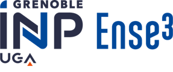
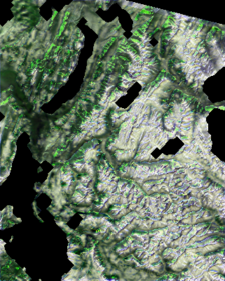
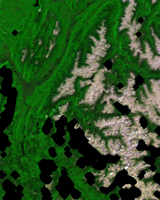
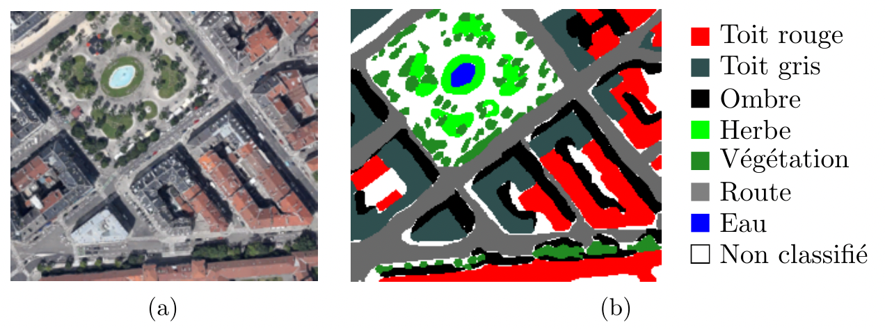
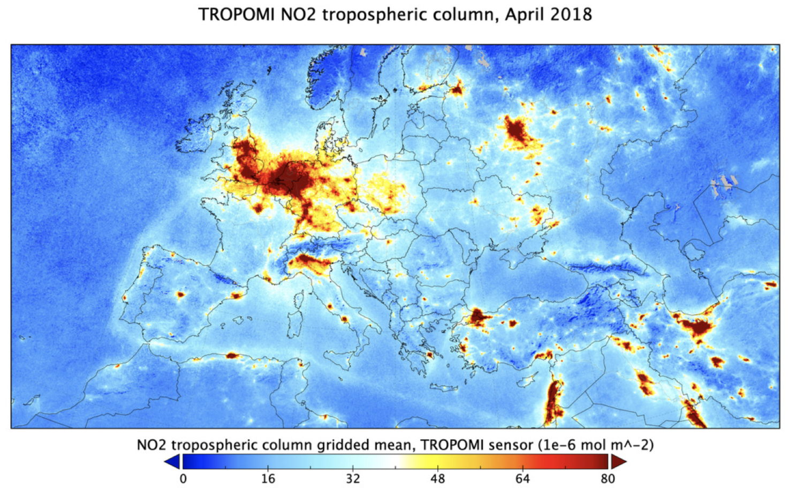
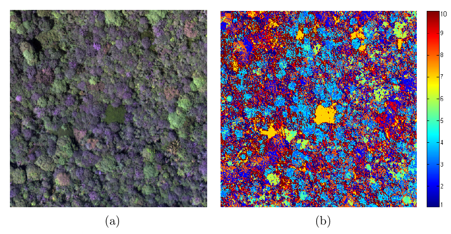
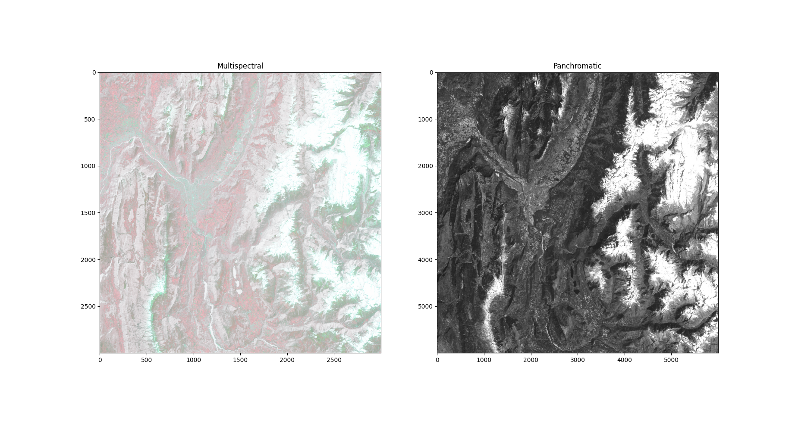
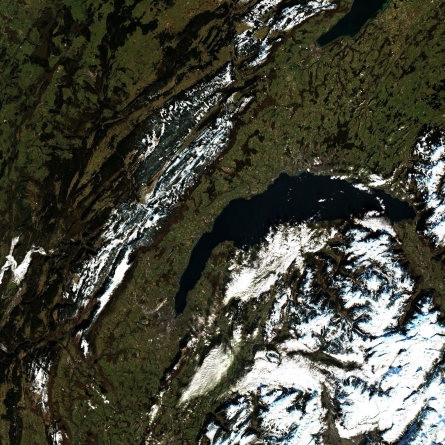

# Remote Sensing Projects
Remote Sensing Projects at ENSE3, Grenoble-INP.

## Announcements
Announcements will be posted here.

  * **Welcome to the remote sensing project**

  * Contacts
    * Aurélien Godet <aurelien.godet@gipsa-lab.grenoble-inp.fr>
    * Daniele Picone <daniele.picone@grenoble-inp.fr>
  
  * Important dates:
    * Intermediate presentation - 5 min pitch (3 slides): 12/05/2025
    * Final presentation (15 min presentation + 5-10 min Q&A): 22/05/2025


## Course information
### Introduction
Remote sensing refers to the analysis of images and signals acquired
over a physical phenomenon in order to obtain information on the surface
of the Earth (including the atmosphere and the oceans), without direct
contact with it.
Thanks to the specificities of the multiple imaging sensors (sensor with very
high spatial resolution or very high spectral resolution, radar, Lidar, etc.)
and the multiplicity of their supports (satellites in particular), remote
sensing is now widely used for problems of observation and monitoring of the
environment.

In this project, students will put into practice the knowledge acquired
in image and signal processing courses on 6 different remote sensing
applications related to the observation of the environment.

This project will be developed in Python.

## Important links
- Projects developed in the previous academic years are available at:  
  <https://www.gricad-gitlab.univ-grenoble-alpes.fr/piconed/remote-sensing-projects-archive>

- The datasets associated to the projects are available at:
  <https://huggingface.co/remote-sensing-ense3-grenoble-inp>


### Objectives of the course
The main objectives of this project are:

* Get familiar with satellite remote sensing and see more in depth an
  applications related to Earth observation
* Apply concepts of image/signal processing and data science
  (machine/deep learning) for the analysis of remote sensing images

Additionally, the student will develop the following set of acquired skills:

* Experience working on project development in a collaborative environment
* Gain experience in Python programming (Python and Jupyter)
* Get familiar with version control (git)
* Get experience with other tools such as Markdown, LaTex, running
  scripts in the terminal.
* Work in English (at least for code development and reporting)
* Contribute to an open project


## Organization
- This project is organized into 10 session of 4 hours each.
- The students will divide in groups of 3 to 4 students and approach one of 
  the problems described in the `Projects` section, or some new proposal, which 
  has to be validated by one of the supervisors.
- Each group is required to present a series of documents, as described in the 
  `Deliverables` section.
- The deliverables have to be presented through a merge request on the central 
  git repository (that is, the repository where this file is located); more
  instructions are provided in the `Deliverables` section.
- The presence to each session is required and each absence will cause a 
  penalization on your final score (0.25 deducted points for each missed hour).

## Getting started

### Choose your project

- In the `projects` folder, there is a list of all the available projects.
  The projects are also hyperlinked later described in the Section *Projects*. 
- Within each folder of your assigned project, a more detailed description is 
  available in the `PROJECT_OVERVIEW.md` file

### Create a personal git repository

- Go to gricad-gitlab: <https://gricad-gitlab.univ-grenoble-alpes.fr/>
- Click on **New project** > **Blank project**
- Select a project name, put it as **Public**, and de-select 
  "Add README.md"
- Note down the repository name. Should be something like:
  ```
  https://gricad-gitlab.univ-grenoble-alpes.fr/username/project.git
  ```
  where `username` is your AGALAN and `project` is the project name
  NOTE: You may want to add your group colleagues as team members.

### Generate a local copy of your project

- From this repository, copy the chosen project from the folder 
  `projects\` to the your local path (in the `C` drive).
- Navigate to your local path and type in the terminal:
  ```bash
  git init -b main
  git remote add origin https://gricad-gitlab.univ-grenoble-alpes.fr/username/project.git
  git pull origin main
  ```
  with the proper link you have generated before

### Create your virtual enviroment

- Install your project dependencies and download the data for your project
  by typing in the terminal:

  - On Linux/Mac:
    ```bash
    cd projectname
    python -m venv .venv --prompt projectname
    source .venv/bin/activate
    pip install pip --upgrade
    pip install -e .
    ```
    or, more briefly, using the provided script:
    ```bash
    cd projectname
    source install.sh
    ```

  - On Windows:
    ```
    cd projectname
    python -m venv .venv --prompt projectname
    Set-ExecutionPolicy RemoteSigned -Scope CurrentUser
    .\.venv\Scripts\activate
    pip install pip --upgrade
    pip install -e .
    ```
### Run the test script

- You can then test the loading script provided:
  ```bash
  python src/data_loading.py
  ```

### Update your code

- From now on, you can modify your local project as it best fits you.
- At every code update run:
  ```
  git add .
  git commit -m "A message for your modifications"
  git pull origin main
  git push origin main
  ```

- Update the # Group Member names section of the `LOG.md` file in your 
  project folder with the names of all the members of your group. 


## Deliverables

The project requires to hand the following material.
Note:
- Please include the names of all the members of the group in both 
  presentation, reports and in the `LOG.md` file in your project folder.
- Please update at the end of each session the `LOG.md` file in your project 
  folder with the work done during the session and the work planned for the 
  next one.
- All the material (code included) has to be provided in English.

### Mid course deliverables
Each group has to provide a pdf for the mid-course presentation slides, which
have to include:
- A *problem statement*, that is:
  - The available resources to process;
  - The prospected geographical area and the timeslot under study
  - The desired products;
  - The methodology to achieve said products (at least in general terms);
  - The ground truth and the measures to compare to it, if applicable.
- A description of the characteristics of the available sensors, specifically:
  - The *ground sample distance* of each band;
  - The bandwidth coverage of each band;
  - Information on the orbit (revisit time, swath, etc.);
  - Possible applications linked to the sensors.
- A tutorial on the input data:
  - How to download (which portal, etc.), in case you use external datasets;
  - How to geolocalize them, in case a transformation to a common geometry is required;
  - The image and metadata format;
  - How to preprocess them (e.g. how to generate a pandas dataframe, or a numpy/torch array);
  - How to visualize them.
- A plan on the image processing methodology:
  - Which family of techniques you are targeting;
  - What are the literature resources.

### End course deliverables
At the final session of the course, each group has to provide:
- A repository containing all the code that you have developed during the 
  project, generated by copying the template of your assigned project from
  this repository. 
  The code should follow the structure to organize your data described in
  `projects\00_template\README.md`.
  This repository has to include:
  - A `README.md` that explains briefly how to launch your code;
  - A main script (in `src/main.py`) that reproduces your full work pipeline.
    Ideally, this code should be launchable with no modification on any 
    machine with the virtual environment information you have provided;
  - All the data that you have downloaded from external sources, and NOT 
    any that was provided by your supervisors;
  - The main script should include:
    - An automatic downloader of the data online, if applicable; 
    - A data visualization script to highlight the characteristics of the 
      input data;
    - A procedure to showcase all the tested methods for data processing;
    - Tests, experiments and results comparisons
    - Optionally, you can also provide a notebook to show the results
      visually; its code has to be minimal, and ideally just call the main 
      function under your `src` folder.
- A pdf for the final presentation slides, extending the mid-course one with:
  - A description of the methods
  - A visual comparison of the results
- A final report written in a compiled pdf (e.g. from LaTeX or Word) or a fully annotated notebook, which details all the work done during the in the project:
    - Sources used in your work (literature, online repositories)
    - Problem statement, with detailed formulation of the input and outputs
    - Mathematical description of the methods
    - Description of the validation framework
    - Discussion on the results:
      - Objective, through quality indices (presented through tables)
      - Qualitative, by visually comparing the results.

### Handing out your deliverables
The deliverables have to be added to your project main folder according to the
project organization described in the following section.

Please follow the provided template to organize your data. 
The project structure is available at `projects\00_template\README.md`, also 
described in the "Getting started" section.

Henceforth, in your project folder:
- `reports`: has to contain the presentations and the final report.
- `src`: has to include the clean Python scripts.
- `notebooks`: optional, which has to include the digital notebooks of your 
  work (Note: Jupyter or marimo notebooks are accepted). These may be used 
  to provide artifacts of your visualized data.

The deliverables are to be handled by:
- providing a link to the forked repository, with access granted to your
  supervisors. This is the preferred method, as it allows to also store
  your data.
These methods are also allowed in case of emergencies:
- as a mail to the supervisors (please include only your project folder), 
  using a [https://filesender.renater.fr/](Renater) link. Please confirm 
  with your supervisor that the data was properly downloaded.
- through Chamilo in the Travaux section, within the  `Projet Teledetection` 
  group of your academic year, uploading a zip file of your project folder.
  Chamilo has a file size limit for uploads, so this is the least preferred
  approach.

The instructions for interfacing through `git` are located in:
`docs\git\report\instructions.pdf`  
More general purpose instructions are available at:
`docs\git\instructions_git.md`.


# Projects

## Active projects

### [2 - Snow cover estimation based on remote sensing time series](projects/02_snow_ts)




### [3 - Mapping the Grenoble urban environment by remote sensing](projects/03_urban)



### [4 - Monitoring pollution in the atmosphere](projects/04_pollution)



### [5 - Analysis of the forest around Grenoble using remote sensing imaging](projects/05_forest)



### [6 - Solar irradiance estimation at GreEn-Er](projects/06_irradiance)


### [8 - Ship detection challenge](projects/08_ship_detection)


### [10 - Pansharpening with SPOT](projects/10_pansharpening)



## Inactive projects
 
### [1 - Snow cover estimation based on remote sensing high spatial resolution images](projects/01_snow_hr)

<!---  --->

### [7 - Urban Monitoring: Change Detection Bundle](projects/07_change_detection)

<!---  --->

### [9 - Remote Sensing video analysis](projects/09_rs_video)

<!---
  <figure class="video_container">
    <iframe src="https://sandbox.intelligence-airbusds.com/web/assets/mp4/beach.mp4" frameborder="0" allowfullscreen="true"> </iframe>
  </figure>
--->
### [11 - Deforestation of the Amazon forest](projects/11_deforestation)


## Useful resources
- Python and Jupyter
  - <https://jakevdp.github.io/PythonDataScienceHandbook/index.html>
    - Ch 1, 2, 4 (Ipython, NumPy, Matplotlib)
    - [optional] Ch. 3, 5 (Pandas, Machine Learning)
    - [jupyter.pdf](docs/python/jupyter.pdf)
  - [optional] Tutorial on Jupyter showcasing jupyter features and installation  <https://www.youtube.com/watch?v=HW29067qVWk>
  - conda cheatsheet <https://docs.conda.io/projects/conda/en/4.6.0/_downloads/52a95608c49671267e40c689e0bc00ca/conda-cheatsheet.pdf>

- Git
  - Introductory videos at <https://git-scm.com/videos> [~30 min in total]

## Coordinator
  - Mauro Dalla Mura (2016-)
## Supervisors
  - Aurélien Godet (2025)
  - Daniele Picone (2021-2022, 2025)
  - Mohamad Jouni (2022-2024)
  - Chloé Poulic (2024)
  - Matthieu Muller (2022-2023)
  - Mauro Dalla Mura (2016-2021)
  - Giuseppe Costantino (2021-2022)
  - Aneline Dolet (2019-2021)
  - Théo Masson (2017-2018)
  - Guillaume Tochon (2016)
