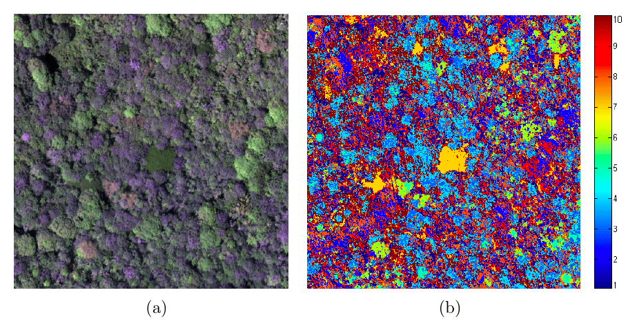

# Analysis of the forest around Grenoble using remote sensing imaging

## Introduction

The study of the large-scale evolution of the bio-diversity of forest ecosystems is a major tool to improve the conservation of these forests. Information on forest structure, number, spatial distribution and identification of different tree species is invaluable knowledge to help manage these forests. However, collecting data directly in the field is a time-consuming and costly process. In addition, access to the sites of interest can be difficult, if not impossible, for humans.

In this respect, satellite/airborne remote sensing seems to be the most practical solution to collect data accurately and regularly. However, the recognition of the different tree species in the forest requires a suitable spectral resolution, in order to capture the subtle variations between two trees of different species. This is why hyperspectral sensors (imagery with very high spectral resolution) are particularly well suited to these needs. In addition, LiDAR (*Light Detection and Ranging*) sensors, giving access to information on the physical structure of the canopy (height above ground level), provide a good complement to hyperspectral imaging. However, the resulting images are very complicated to use, due to the great complexity of the canopy in terms of density, structure, and species richness.

## Project development

### Objectives

The objective of this project is to carry out the *classification* of hyperspectral images acquired at different locations around Grenoble. More specifically, the aim is to detect the different tree species that make up the forest, and to assign each pixel to the *class* corresponding to its species (see figure below). The classification process is particularly sensitive to different parameters:
- The nature of the classifier used. The latter can be *unsupervised* or *supervised*. In the latter case, external knowledge of the different classes and their spectral characteristics is required, whereas the former case tries to "guess" these characteristics simply from the data.
- The nature of the pre-processing applied to the data. It is known that certain types of pre-processing (e.g. noise reduction, selection of only certain bands of the hyperspectral image) can improve classification performance.

It is up to you to vary the different parameters you can influence to find the configuration that gives the best possible classification!

*Example of tree species classification*

Finally, you will be implementing your algorithms in Python, so you might as well start learning good programming practices with this language right away. It's up to you to organise yourself to harmonise the different scripts you are going to write!

### Available data

A complementary document explaining the available data (hyperspectral and LiDAR) and the beginnings of codes to use these data will be provided at the beginning of the project.

## Here are some ideas...

Here are some ideas you can explore:
- Image classification is a vast field of study in remote sensing, and you obviously can't cover it all in 40 hours... Nevertheless, there are two main classes of classifiers, namely supervised and unsupervised classifiers. It is up to you to test the most popular classifiers you can find.
- Similarly, the classification results depend on two things (in addition to the choice of classifier): the pre-processing done on the image, and the post-processing done on the classification map.
    - The pre-processing particularly aims at exploiting the idea that two neighbouring bands in a hyperspectral image are highly correlated, and that not all bands are necessarily "necessary" in the sense that all useful information is contained in fewer bands than are available. There are several methods to bring out this useful information while reducing the number of bands, such as principal component analysis, or spectral unmixing...
    - Post-processing aims at reducing the effect of "pixel noise" on the classification map, based on the principle that two neighbouring pixels have a high probability of belonging to the same class. In this way, it is possible to spatially *regularise* the classification map, by classifying by *regions* and not by pixel. Obtaining a good segmentation map (dividing the image into coherent areas) can therefore be useful...
- The information provided by LiDAR is not sufficient on its own to differentiate between different tree species, but it can be integrated into the classification process (and potentially improve it) in many different ways. It is up to you to make the best use of this information.

Keep the following points in mind:
- This is a project, not a tutorial. We do not have the exact solution, so there is no need to expect us to give you that solution.
- Besides, a perfect solution most probably does not exist! Your goal is to find the solution that you think is best.
- This solution should be as robust as possible. If you are basically only working on a certain portion of the image provided, make sure that the results are still correct by testing your method on another portion of that image.
- This is a (very) ambitious project, don't be discouraged!
- The notions acquired during the elective course of image processing will not be sufficient, it is up to you to deepen your knowledge as much as possible (you will find on the net a great number of websites presenting tutorials on image processing techniques, if you look for them). We are of course also available to answer your questions. Enjoy it, be curious, and most importantly, have fun! 😁

